# 仙途（XianTu）架构分析文档

## 目录

- [1. 项目概述](#1-项目概述)
- [2. 技术栈架构](#2-技术栈架构)
- [3. 系统整体架构](#3-系统整体架构)
- [4. 前端架构详解](#4-前端架构详解)
- [5. 后端架构详解](#5-后端架构详解)
- [6. 核心业务模块](#6-核心业务模块)
- [7. 数据流与状态管理](#7-数据流与状态管理)
- [8. AI服务架构](#8-ai服务架构)
- [9. 存储方案设计](#9-存储方案设计)
- [10. 部署与CI/CD](#10-部署与cicd)
- [11. 安全与性能](#11-安全与性能)
- [12. 总结与展望](#12-总结与展望)

---

## 1. 项目概述

### 1.1 项目定位

**仙途（XianTu）** 是一款基于大语言模型（LLM）驱动的沉浸式修仙文字冒险游戏。项目采用现代化的前后端分离架构，结合AI技术实现动态叙事和智能判定系统。

### 1.2 核心特性

- **AI动态叙事**：支持Gemini/Claude/OpenAI/DeepSeek等多种大模型
- **完整修仙体系**：9个境界等级，三千大道系统，功法装备炼制
- **智能判定系统**：基于多维度属性的D20骰子机制
- **多存档管理**：支持本地多存档、云同步和数据导入导出
- **开放世界**：10个预设世界，PixiJS渲染的2D地图系统
- **SillyTavern集成**：无缝嵌入式集成，支持酒馆模式
- **全平台适配**：响应式设计，支持桌面端和移动端，亮/暗双主题

### 1.3 项目规模

| 指标 | 数值 |
|------|------|
| 代码库大小 | 93 MB |
| 前端源代码行数 | ~27,134 行 |
| 源文件数量 | 220+ 个 |
| Vue组件数量 | 70+ 个 |
| API端点数量 | 18 个模块 |
| 当前版本 | V3.7.4 (2026-01-02) |
| 开源协议 | Apache License 2.0 |

---

## 2. 技术栈架构

### 2.1 前端技术栈

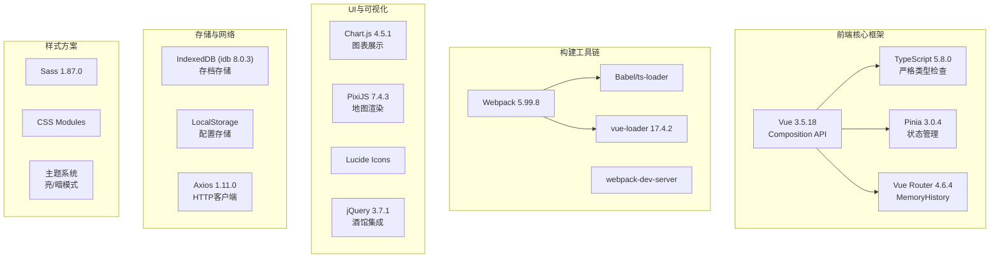
```mermaid
graph TB
    subgraph "前端核心框架"
        Vue["Vue 3.5.18<br/>Composition API"]
        TS["TypeScript 5.8.0<br/>严格类型检查"]
        Pinia["Pinia 3.0.4<br/>状态管理"]
        Router["Vue Router 4.6.4<br/>MemoryHistory"]
    end

    subgraph "构建工具链"
        Webpack["Webpack 5.99.8"]
        Babel["Babel/ts-loader"]
        VueLoader["vue-loader 17.4.2"]
        DevServer["webpack-dev-server"]
    end

    subgraph "UI与可视化"
        Chart["Chart.js 4.5.1<br/>图表展示"]
        Pixi["PixiJS 7.4.3<br/>地图渲染"]
        Lucide["Lucide Icons"]
        jQuery["jQuery 3.7.1<br/>酒馆集成"]
    end

    subgraph "存储与网络"
        IDB["IndexedDB (idb 8.0.3)<br/>存档存储"]
        LocalStorage["LocalStorage<br/>配置存储"]
        Axios["Axios 1.11.0<br/>HTTP客户端"]
    end

    subgraph "样式方案"
        Sass["Sass 1.87.0"]
        CSS["CSS Modules"]
        Theme["主题系统<br/>亮/暗模式"]
    end

    Vue --> TS
    Vue --> Pinia
    Vue --> Router
    Webpack --> Babel
    Webpack --> VueLoader
```

### 2.2 后端技术栈

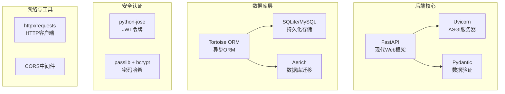
```mermaid
graph TB
    subgraph "后端核心"
        FastAPI["FastAPI<br/>现代Web框架"]
        Uvicorn["Uvicorn<br/>ASGI服务器"]
        Pydantic["Pydantic<br/>数据验证"]
    end

    subgraph "数据库层"
        Tortoise["Tortoise ORM<br/>异步ORM"]
        Aerich["Aerich<br/>数据库迁移"]
        SQLite["SQLite/MySQL<br/>持久化存储"]
    end

    subgraph "安全认证"
        JWT["python-jose<br/>JWT令牌"]
        Bcrypt["passlib + bcrypt<br/>密码哈希"]
    end

    subgraph "网络与工具"
        HTTPX["httpx/requests<br/>HTTP客户端"]
        CORS["CORS中间件"]
    end

    FastAPI --> Uvicorn
    FastAPI --> Pydantic
    Tortoise --> SQLite
    Tortoise --> Aerich
```

### 2.3 DevOps工具链

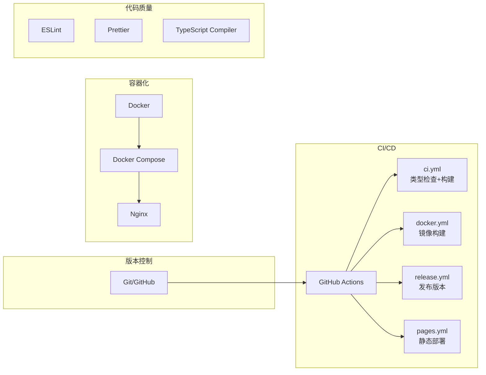
```mermaid
graph LR
    subgraph "版本控制"
        Git["Git/GitHub"]
    end

    subgraph "CI/CD"
        GHA["GitHub Actions"]
        CI["ci.yml<br/>类型检查+构建"]
        Docker["docker.yml<br/>镜像构建"]
        Release["release.yml<br/>发布版本"]
        Pages["pages.yml<br/>静态部署"]
    end

    subgraph "容器化"
        DockerImg["Docker"]
        Compose["Docker Compose"]
        Nginx["Nginx"]
    end

    subgraph "代码质量"
        ESLint["ESLint"]
        Prettier["Prettier"]
        TSC["TypeScript Compiler"]
    end

    Git --> GHA
    GHA --> CI
    GHA --> Docker
    GHA --> Release
    GHA --> Pages
    DockerImg --> Compose
    Compose --> Nginx
```

---

## 3. 系统整体架构

### 3.1 系统架构图

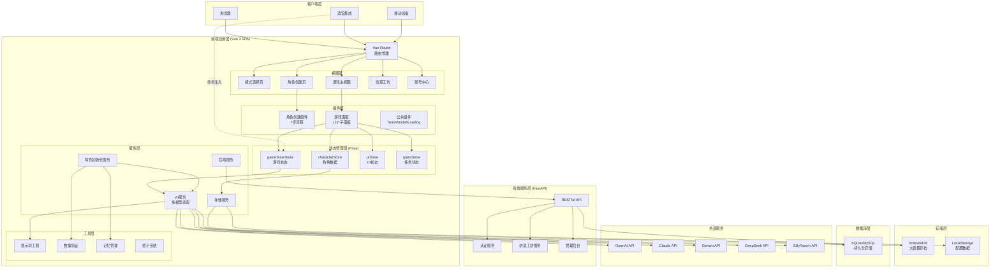
```mermaid
graph TB
    subgraph "客户端层"
        Browser["浏览器"]
        Tavern["SillyTavern<br/>iframe嵌入"]
        Mobile["移动设备"]
    end

    subgraph "前端应用层 (Vue 3 SPA)"
        Router["Vue Router<br/>路由管理"]

        subgraph "视图层"
            ModeView["模式选择页"]
            CreateView["角色创建页"]
            GameView["游戏主视图"]
            WorkshopView["创意工坊"]
            AccountView["账号中心"]
        end

        subgraph "组件层"
            CharCreate["角色创建组件<br/>7步流程"]
            Dashboard["游戏面板<br/>11个子面板"]
            Common["公共组件<br/>Toast/Modal/Loading"]
        end

        subgraph "状态管理层 (Pinia)"
            CharStore["characterStore<br/>角色数据"]
            GameStore["gameStateStore<br/>游戏状态"]
            UIStore["uiStore<br/>UI状态"]
            QuestStore["questStore<br/>任务状态"]
        end

        subgraph "服务层"
            AIService["AI服务<br/>多模型适配"]
            CharInit["角色初始化服务"]
            BackendService["后端服务"]
            StorageService["存储服务"]
        end

        subgraph "工具层"
            Prompts["提示词工程"]
            Validation["数据验证"]
            Memory["记忆管理"]
            Dice["骰子系统"]
            Tavern["酒馆集成"]
        end
    end

    subgraph "存储层"
        IDB["IndexedDB<br/>大容量存档"]
        LocalStorage["LocalStorage<br/>配置数据"]
    end

    subgraph "后端服务层 (FastAPI)"
        API["RESTful API"]
        Auth["认证服务"]
        Workshop["创意工坊服务"]
        Admin["管理后台"]
    end

    subgraph "数据库层"
        DB["SQLite/MySQL<br/>持久化存储"]
    end

    subgraph "外部服务"
        OpenAI["OpenAI API"]
        Claude["Claude API"]
        Gemini["Gemini API"]
        DeepSeek["DeepSeek API"]
        TavernAPI["SillyTavern API"]
    end

    Browser --> Router
    Tavern --> Router
    Mobile --> Router

    Router --> ModeView
    Router --> CreateView
    Router --> GameView
    Router --> WorkshopView
    Router --> AccountView

    CreateView --> CharCreate
    GameView --> Dashboard

    Dashboard --> CharStore
    Dashboard --> GameStore
    Dashboard --> UIStore
    Dashboard --> QuestStore

    CharStore --> StorageService
    GameStore --> AIService

    AIService --> Prompts
    AIService --> OpenAI
    AIService --> Claude
    AIService --> Gemini
    AIService --> DeepSeek
    AIService --> TavernAPI

    StorageService --> IDB
    StorageService --> LocalStorage

    BackendService --> API
    API --> Auth
    API --> Workshop
    API --> Admin
    API --> DB

    CharInit --> AIService
    CharInit --> Validation
    CharInit --> Memory

    Tavern -.->|命令注入| GameStore
```

### 3.2 架构分层说明

| 层级 | 职责 | 核心技术 |
|------|------|----------|
| **客户端层** | 用户交互入口 | Browser/SillyTavern/Mobile |
| **视图层** | 页面路由与布局 | Vue Router, Vue Components |
| **组件层** | UI组件与交互逻辑 | Vue 3 Composition API |
| **状态管理层** | 全局状态管理 | Pinia Stores |
| **服务层** | 业务逻辑封装 | TypeScript Services |
| **工具层** | 通用工具函数 | Utils/Helpers |
| **存储层** | 客户端数据持久化 | IndexedDB/LocalStorage |
| **后端服务层** | API服务与业务逻辑 | FastAPI/Uvicorn |
| **数据库层** | 数据持久化 | SQLite/MySQL |
| **外部服务** | 第三方API集成 | AI APIs/SillyTavern |

---

## 4. 前端架构详解

### 4.1 目录结构

```
src/
├── components/           # Vue组件
│   ├── character-creation/   # 角色创建流程组件
│   ├── common/              # 公共组件
│   └── dashboard/           # 游戏面板组件
├── composables/         # 组合式函数
├── data/                # 静态数据
├── i18n/                # 国际化
├── router/              # 路由配置
├── services/            # 业务服务层
├── stores/              # Pinia状态管理
├── styles/              # 全局样式
├── types/               # TypeScript类型定义
├── utils/               # 工具函数
├── views/               # 页面视图
├── App.vue              # 根组件
└── main.ts              # 应用入口
```

### 4.2 路由架构

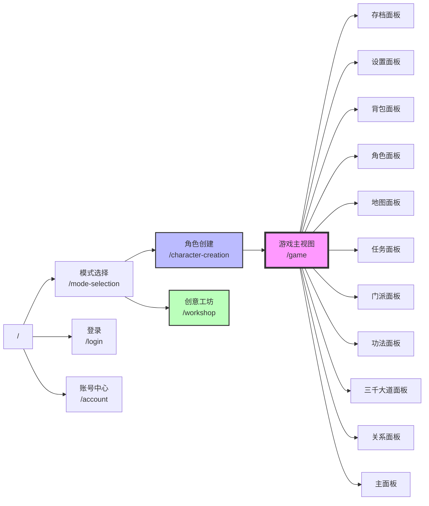
```mermaid
graph LR
    Root["/"] --> ModeSelection["模式选择<br/>/mode-selection"]
    Root --> Login["登录<br/>/login"]
    Root --> Account["账号中心<br/>/account"]

    ModeSelection --> CharCreation["角色创建<br/>/character-creation"]
    ModeSelection --> Workshop["创意工坊<br/>/workshop"]

    CharCreation --> Game["游戏主视图<br/>/game"]

    Game --> SavePanel["存档面板"]
    Game --> SettingsPanel["设置面板"]
    Game --> InventoryPanel["背包面板"]
    Game --> CharPanel["角色面板"]
    Game --> MapPanel["地图面板"]
    Game --> QuestPanel["任务面板"]
    Game --> SectPanel["门派面板"]
    Game --> SkillPanel["功法面板"]
    Game --> DaoPanel["三千大道面板"]
    Game --> RelationPanel["关系面板"]
    Game --> MainPanel["主面板"]

    style Game fill:#f9f,stroke:#333,stroke-width:4px
    style CharCreation fill:#bbf,stroke:#333,stroke-width:2px
    style Workshop fill:#bfb,stroke:#333,stroke-width:2px
```

**路由模式**: MemoryHistory（适配SillyTavern嵌入模式）

### 4.3 角色创建流程架构

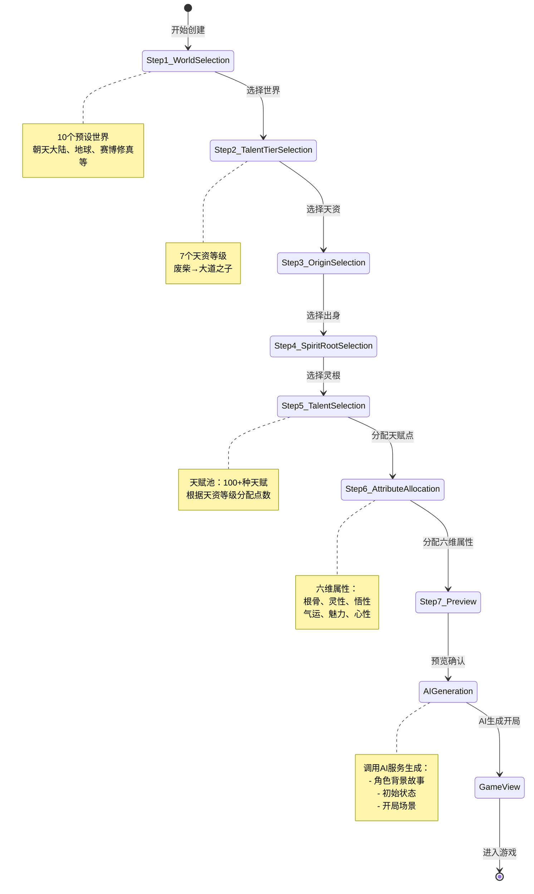
```mermaid
stateDiagram-v2
    [*] --> Step1_WorldSelection: 开始创建
    Step1_WorldSelection --> Step2_TalentTierSelection: 选择世界
    Step2_TalentTierSelection --> Step3_OriginSelection: 选择天资
    Step3_OriginSelection --> Step4_SpiritRootSelection: 选择出身
    Step4_SpiritRootSelection --> Step5_TalentSelection: 选择灵根
    Step5_TalentSelection --> Step6_AttributeAllocation: 分配天赋点
    Step6_AttributeAllocation --> Step7_Preview: 分配六维属性
    Step7_Preview --> AIGeneration: 预览确认
    AIGeneration --> GameView: AI生成开局
    GameView --> [*]: 进入游戏

    note right of Step1_WorldSelection
        10个预设世界
        朝天大陆、地球、赛博修真等
    end note

    note right of Step2_TalentTierSelection
        7个天资等级
        废柴→大道之子
    end note

    note right of Step5_TalentSelection
        天赋池：100+种天赋
        根据天资等级分配点数
    end note

    note right of Step6_AttributeAllocation
        六维属性：
        根骨、灵性、悟性
        气运、魅力、心性
    end note

    note right of AIGeneration
        调用AI服务生成：
        - 角色背景故事
        - 初始状态
        - 开局场景
    end note
```

**关键文件**:
- `src/stores/characterCreationStore.ts` - 创角流程状态管理
- `src/services/characterInitialization.ts` - AI驱动的角色初始化
- `src/data/creationData.ts` - 创角静态数据（世界、天资、出身、灵根、天赋）

### 4.4 游戏主界面架构

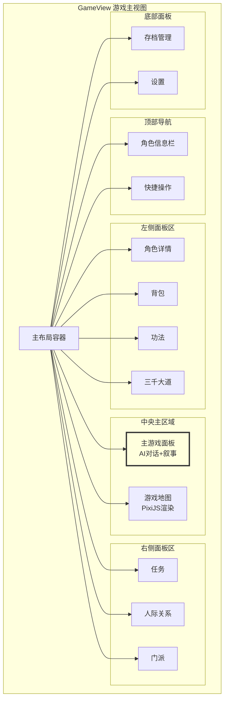
```mermaid
graph TB
    subgraph "GameView 游戏主视图"
        MainLayout["主布局容器"]

        subgraph "顶部导航"
            CharInfo["角色信息栏"]
            QuickAction["快捷操作"]
        end

        subgraph "左侧面板区"
            CharPanel["角色详情"]
            InventoryPanel["背包"]
            SkillPanel["功法"]
            DaoPanel["三千大道"]
        end

        subgraph "中央主区域"
            MainPanel["主游戏面板<br/>AI对话+叙事"]
            MapPanel["游戏地图<br/>PixiJS渲染"]
        end

        subgraph "右侧面板区"
            QuestPanel["任务"]
            RelationPanel["人际关系"]
            SectPanel["门派"]
        end

        subgraph "底部面板"
            SavePanel["存档管理"]
            SettingsPanel["设置"]
        end
    end

    MainLayout --> CharInfo
    MainLayout --> QuickAction
    MainLayout --> CharPanel
    MainLayout --> InventoryPanel
    MainLayout --> SkillPanel
    MainLayout --> DaoPanel
    MainLayout --> MainPanel
    MainLayout --> MapPanel
    MainLayout --> QuestPanel
    MainLayout --> RelationPanel
    MainLayout --> SectPanel
    MainLayout --> SavePanel
    MainLayout --> SettingsPanel

    style MainPanel fill:#ffd,stroke:#333,stroke-width:3px
```

**面板通信机制**:
```typescript
// 事件总线: src/utils/panelBus.ts
EventBus.emit('panelSwitch', { from: 'main', to: 'inventory' })
EventBus.on('dataUpdate', (data) => { /* 处理数据更新 */ })
```

---

## 5. 后端架构详解

### 5.1 后端目录结构

```
server/
├── api/
│   └── api_v1/
│       ├── endpoints/      # API端点
│       │   ├── auth.py
│       │   ├── characters.py
│       │   ├── workshop.py
│       │   ├── worlds.py
│       │   ├── talents.py
│       │   └── ...
│       └── deps.py         # 依赖注入
├── core/
│   ├── config.py           # 配置管理
│   ├── security.py         # 安全认证
│   ├── character_calculation.py  # 角色计算
│   └── seed_*.py           # 种子数据
├── crud/                   # 数据库CRUD
├── models.py               # 数据模型
├── database.py             # 数据库配置
├── main.py                 # 应用入口
└── requirements.txt        # 依赖
```

### 5.2 API架构

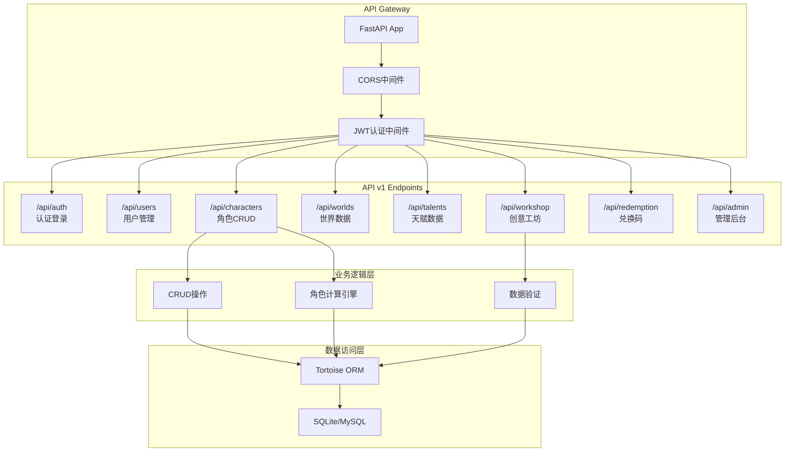
```mermaid
graph TB
    subgraph "API Gateway"
        FastAPI["FastAPI App"]
        CORS["CORS中间件"]
        Auth["JWT认证中间件"]
    end

    subgraph "API v1 Endpoints"
        AuthAPI["/api/auth<br/>认证登录"]
        UserAPI["/api/users<br/>用户管理"]
        CharAPI["/api/characters<br/>角色CRUD"]
        WorldAPI["/api/worlds<br/>世界数据"]
        TalentAPI["/api/talents<br/>天赋数据"]
        WorkshopAPI["/api/workshop<br/>创意工坊"]
        RedemptionAPI["/api/redemption<br/>兑换码"]
        AdminAPI["/api/admin<br/>管理后台"]
    end

    subgraph "业务逻辑层"
        CRUD["CRUD操作"]
        Calculation["角色计算引擎"]
        Validation["数据验证"]
    end

    subgraph "数据访问层"
        ORM["Tortoise ORM"]
        DB["SQLite/MySQL"]
    end

    FastAPI --> CORS
    CORS --> Auth
    Auth --> AuthAPI
    Auth --> UserAPI
    Auth --> CharAPI
    Auth --> WorldAPI
    Auth --> TalentAPI
    Auth --> WorkshopAPI
    Auth --> RedemptionAPI
    Auth --> AdminAPI

    CharAPI --> CRUD
    CharAPI --> Calculation
    WorkshopAPI --> Validation

    CRUD --> ORM
    Calculation --> ORM
    Validation --> ORM
    ORM --> DB
```

### 5.3 数据模型设计

```mermaid
erDiagram
    PLAYER_ACCOUNTS ||--o{ PLAYER_CHARACTERS : "拥有"
    PLAYER_ACCOUNTS {
        int id PK
        string username UK
        string email UK
        string hashed_password
        string role
        datetime created_at
        datetime last_login
    }

    PLAYER_CHARACTERS ||--o{ CHARACTER_SAVES : "拥有存档"
    PLAYER_CHARACTERS {
        int id PK
        int player_id FK
        string character_name
        string character_data JSON
        datetime created_at
        datetime updated_at
    }

    CHARACTER_SAVES {
        int id PK
        int character_id FK
        string save_name
        string save_data JSON
        datetime created_at
    }

    WORLDS ||--o{ PLAYER_CHARACTERS : "关联"
    WORLDS {
        int id PK
        string name
        string description
        string setting JSON
        bool is_official
    }

    TALENT_TIERS ||--o{ CORE_TALENTS : "包含"
    TALENT_TIERS {
        int id PK
        string tier_name
        int tier_level
        int talent_points
    }

    CORE_TALENTS {
        int id PK
        string name
        string description
        string effects JSON
        int tier_id FK
    }

    CORE_ORIGINS {
        int id PK
        string name
        string description
        string bonuses JSON
    }

    CORE_SPIRIT_ROOTS {
        int id PK
        string name
        string element
        float cultivation_speed
        string special_effects JSON
    }
```

### 5.4 认证与授权流程

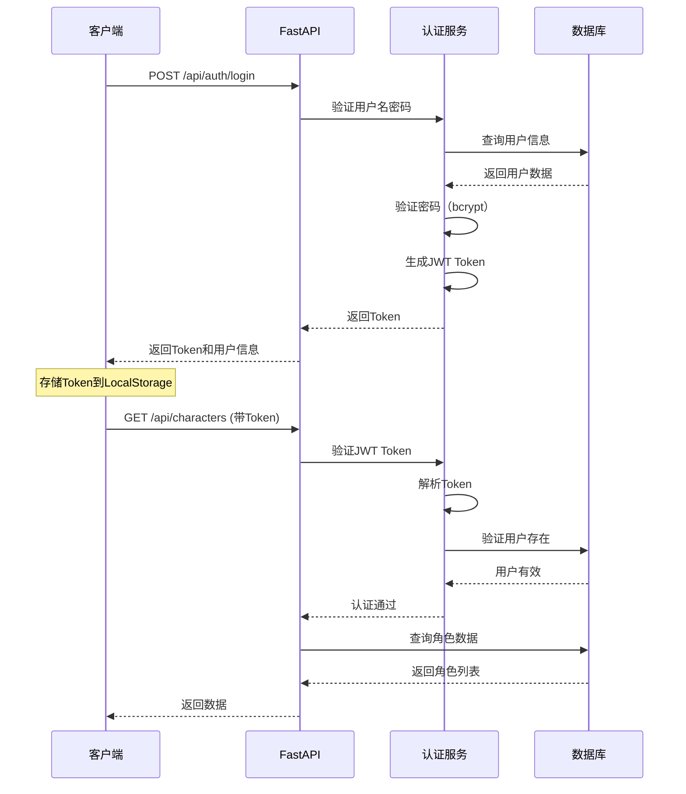
```mermaid
sequenceDiagram
    participant Client as 客户端
    participant API as FastAPI
    participant Auth as 认证服务
    participant DB as 数据库

    Client->>API: POST /api/auth/login
    API->>Auth: 验证用户名密码
    Auth->>DB: 查询用户信息
    DB-->>Auth: 返回用户数据
    Auth->>Auth: 验证密码（bcrypt）
    Auth->>Auth: 生成JWT Token
    Auth-->>API: 返回Token
    API-->>Client: 返回Token和用户信息

    Note over Client: 存储Token到LocalStorage

    Client->>API: GET /api/characters (带Token)
    API->>Auth: 验证JWT Token
    Auth->>Auth: 解析Token
    Auth->>DB: 验证用户存在
    DB-->>Auth: 用户有效
    Auth-->>API: 认证通过
    API->>DB: 查询角色数据
    DB-->>API: 返回角色列表
    API-->>Client: 返回数据
```

---

## 6. 核心业务模块

### 6.1 修仙体系架构

#### 6.1.1 境界系统

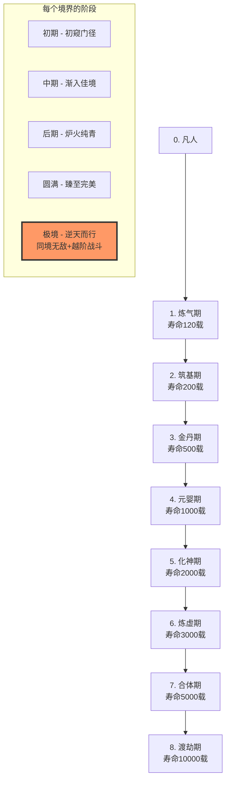
```mermaid
graph TD
    Mortal["0. 凡人"] --> QiRefining["1. 炼气期<br/>寿命120载"]
    QiRefining --> Foundation["2. 筑基期<br/>寿命200载"]
    Foundation --> GoldenCore["3. 金丹期<br/>寿命500载"]
    GoldenCore --> NascentSoul["4. 元婴期<br/>寿命1000载"]
    NascentSoul --> SoulTransform["5. 化神期<br/>寿命2000载"]
    SoulTransform --> VoidRefining["6. 炼虚期<br/>寿命3000载"]
    VoidRefining --> BodyFusion["7. 合体期<br/>寿命5000载"]
    BodyFusion --> Tribulation["8. 渡劫期<br/>寿命10000载"]

    subgraph "每个境界的阶段"
        Early["初期 - 初窥门径"]
        Mid["中期 - 渐入佳境"]
        Late["后期 - 炉火纯青"]
        Perfect["圆满 - 臻至完美"]
        Extreme["极境 - 逆天而行<br/>同境无敌+越阶战斗"]
    end

    style Extreme fill:#f96,stroke:#333,stroke-width:3px
```

**突破机制**:
- **难度等级**: 普通、困难、逆天（影响突破成功率）
- **资源倍率**: 所需灵力/丹药倍数
- **寿命加成**: 突破后寿命增加
- **特殊能力**: 解锁新技能或大道

**数据文件**: `src/data/realms.ts:1-150`

#### 6.1.2 三千大道系统

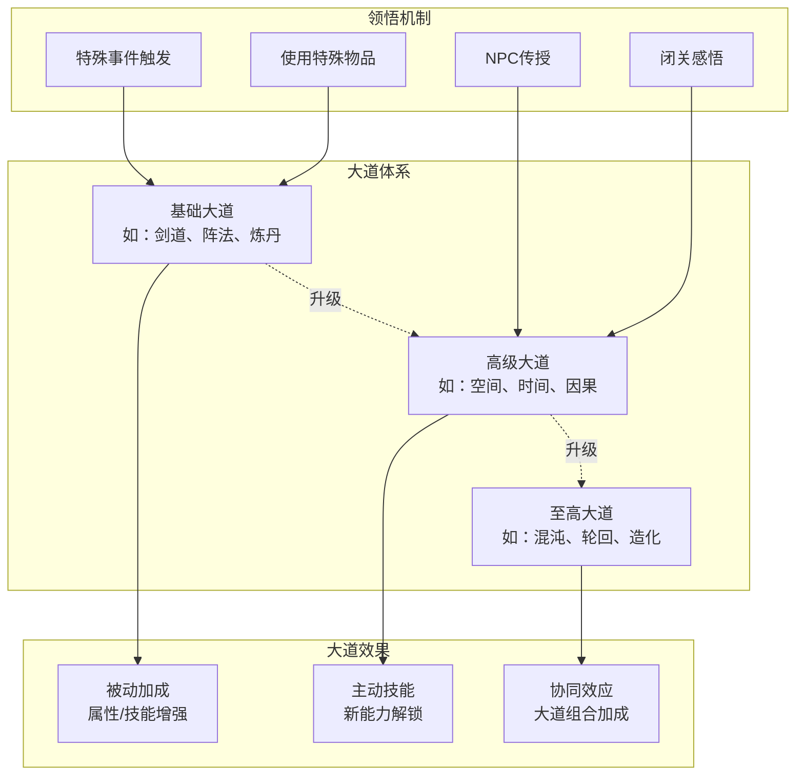
```mermaid
graph TB
    subgraph "大道体系"
        Basic["基础大道<br/>如：剑道、阵法、炼丹"]
        Advanced["高级大道<br/>如：空间、时间、因果"]
        Ultimate["至高大道<br/>如：混沌、轮回、造化"]
    end

    subgraph "领悟机制"
        Event["特殊事件触发"]
        Item["使用特殊物品"]
        NPC["NPC传授"]
        Meditation["闭关感悟"]
    end

    subgraph "大道效果"
        Passive["被动加成<br/>属性/技能增强"]
        Active["主动技能<br/>新能力解锁"]
        Synergy["协同效应<br/>大道组合加成"]
    end

    Event --> Basic
    Item --> Basic
    NPC --> Advanced
    Meditation --> Advanced

    Basic --> Passive
    Advanced --> Active
    Ultimate --> Synergy

    Basic -.升级.-> Advanced
    Advanced -.升级.-> Ultimate
```

**数据文件**: `src/data/thousandDaoData.ts:1-200`

#### 6.1.3 物品品质系统

| 品质 | 等阶范围 | 颜色 | 稀有度 |
|------|---------|------|--------|
| 凡品 | 1-9阶 | #FFFFFF | 常见 |
| 下品 | 1-9阶 | #4169E1 | 普通 |
| 中品 | 1-9阶 | #9932CC | 稀有 |
| 上品 | 1-9阶 | #FFD700 | 珍贵 |
| 极品 | 1-9阶 | #FF4500 | 罕见 |
| 圣品 | 1-9阶 | #FF0000 | 传说 |
| 仙品 | 1-9阶 | #00FFFF | 神话 |

**数据文件**: `src/data/itemQuality.ts:1-80`

### 6.2 角色属性系统

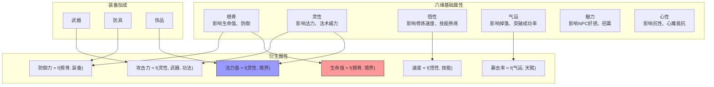
```mermaid
graph TB
    subgraph "六维基础属性"
        Constitution["根骨<br/>影响生命值、防御"]
        Spirituality["灵性<br/>影响法力、法术威力"]
        Comprehension["悟性<br/>影响修炼速度、技能熟练"]
        Luck["气运<br/>影响掉落、突破成功率"]
        Charisma["魅力<br/>影响NPC好感、招募"]
        Mentality["心性<br/>影响抗性、心魔抵抗"]
    end

    subgraph "衍生属性"
        HP["生命值 = f(根骨, 境界)"]
        MP["法力值 = f(灵性, 境界)"]
        Defense["防御力 = f(根骨, 装备)"]
        Attack["攻击力 = f(灵性, 武器, 功法)"]
        Speed["速度 = f(悟性, 技能)"]
        CritRate["暴击率 = f(气运, 天赋)"]
    end

    subgraph "装备加成"
        Weapon["武器"]
        Armor["防具"]
        Accessory["饰品"]
    end

    Constitution --> HP
    Constitution --> Defense
    Spirituality --> MP
    Spirituality --> Attack
    Comprehension --> Speed
    Luck --> CritRate

    Weapon --> Attack
    Armor --> Defense
    Accessory --> MP

    style HP fill:#f99,stroke:#333
    style MP fill:#99f,stroke:#333
```

**属性来源**:
- **先天属性**: 创角时分配
- **后天属性**: 修炼、突破、丹药提升
- **装备加成**: 穿戴装备提供
- **天赋加成**: 天赋被动效果
- **状态加成**: Buff/Debuff临时效果

**计算文件**: `server/core/character_calculation.py:1-300`

### 6.3 智能判定系统

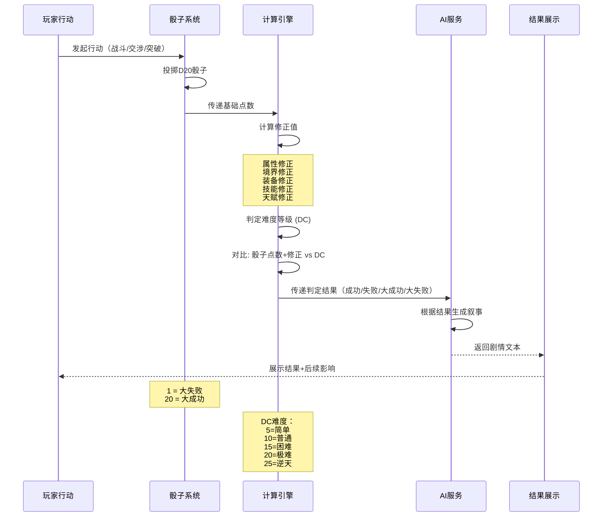
```mermaid
sequenceDiagram
    participant Player as 玩家行动
    participant Dice as 骰子系统
    participant Calc as 计算引擎
    participant AI as AI服务
    participant Result as 结果展示

    Player->>Dice: 发起行动（战斗/交涉/突破）
    Dice->>Dice: 投掷D20骰子
    Dice->>Calc: 传递基础点数

    Calc->>Calc: 计算修正值
    Note over Calc: 属性修正<br/>境界修正<br/>装备修正<br/>技能修正<br/>天赋修正

    Calc->>Calc: 判定难度等级 (DC)
    Calc->>Calc: 对比: 骰子点数+修正 vs DC

    Calc->>AI: 传递判定结果（成功/失败/大成功/大失败）
    AI->>AI: 根据结果生成叙事
    AI-->>Result: 返回剧情文本

    Result-->>Player: 展示结果+后续影响

    Note over Dice: 1 = 大失败<br/>20 = 大成功
    Note over Calc: DC难度：<br/>5=简单<br/>10=普通<br/>15=困难<br/>20=极难<br/>25=逆天
```

**核心文件**: `src/utils/diceRoller.ts:1-250`

---

## 7. 数据流与状态管理

### 7.1 Pinia状态管理架构

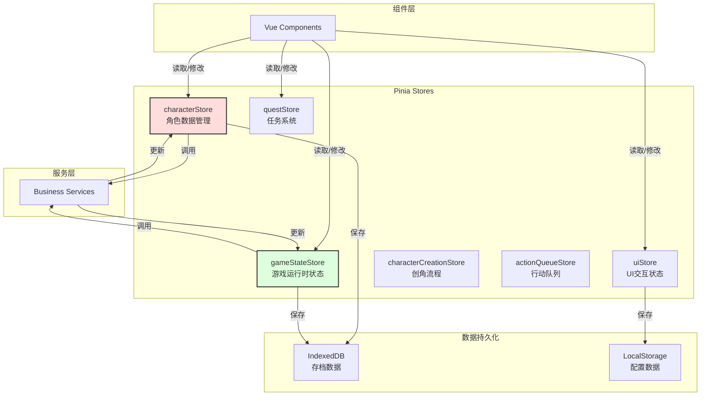
```mermaid
graph TB
    subgraph "Pinia Stores"
        CharStore["characterStore<br/>角色数据管理"]
        GameStore["gameStateStore<br/>游戏运行时状态"]
        UIStore["uiStore<br/>UI交互状态"]
        QuestStore["questStore<br/>任务系统"]
        CreationStore["characterCreationStore<br/>创角流程"]
        ActionStore["actionQueueStore<br/>行动队列"]
    end

    subgraph "数据持久化"
        IDB["IndexedDB<br/>存档数据"]
        LocalStorage["LocalStorage<br/>配置数据"]
    end

    subgraph "组件层"
        Components["Vue Components"]
    end

    subgraph "服务层"
        Services["Business Services"]
    end

    Components -->|读取/修改| CharStore
    Components -->|读取/修改| GameStore
    Components -->|读取/修改| UIStore
    Components -->|读取/修改| QuestStore

    CharStore -->|保存| IDB
    GameStore -->|保存| IDB
    UIStore -->|保存| LocalStorage

    CharStore -->|调用| Services
    GameStore -->|调用| Services

    Services -->|更新| CharStore
    Services -->|更新| GameStore

    style CharStore fill:#fdd,stroke:#333,stroke-width:2px
    style GameStore fill:#dfd,stroke:#333,stroke-width:2px
```

### 7.2 核心Store详解

#### 7.2.1 characterStore

**职责**: 管理角色核心数据

**核心状态**:
```typescript
{
  characters: Record<string, CharacterProfile>,  // 所有角色
  currentCharacterId: string | null,             // 当前角色ID
  currentSaveSlot: number | null,                // 当前存档槽位
  saveData: SaveData | null,                     // 当前存档数据
}
```

**核心方法**:
- `createCharacter()` - 创建新角色
- `loadCharacter()` - 加载角色存档
- `saveCharacter()` - 保存角色数据
- `deleteCharacter()` - 删除角色
- `exportSave()` / `importSave()` - 导入导出

**文件**: `src/stores/characterStore.ts:1-800`

#### 7.2.2 gameStateStore

**职责**: 管理游戏运行时状态

**核心状态**:
```typescript
{
  isGameActive: boolean,             // 游戏是否激活
  currentPanel: string,              // 当前显示面板
  conversationHistory: Message[],    // 对话历史
  pendingAction: Action | null,      // 待执行行动
  isAIProcessing: boolean,           // AI是否处理中
}
```

**核心方法**:
- `startGame()` - 开始游戏
- `sendAction()` - 发送玩家行动到AI
- `updateGameState()` - 更新游戏状态
- `switchPanel()` - 切换面板

**文件**: `src/stores/gameStateStore.ts:1-600`

### 7.3 数据流动图

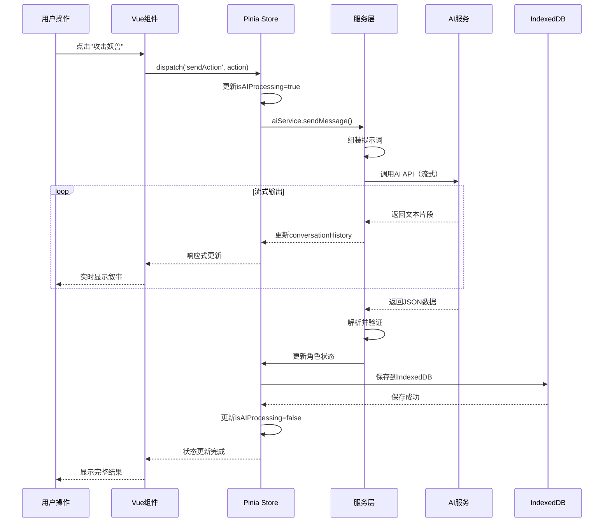
```mermaid
sequenceDiagram
    participant User as 用户操作
    participant Component as Vue组件
    participant Store as Pinia Store
    participant Service as 服务层
    participant AI as AI服务
    participant Storage as IndexedDB

    User->>Component: 点击"攻击妖兽"
    Component->>Store: dispatch('sendAction', action)
    Store->>Store: 更新isAIProcessing=true
    Store->>Service: aiService.sendMessage()

    Service->>Service: 组装提示词
    Service->>AI: 调用AI API（流式）

    loop 流式输出
        AI-->>Service: 返回文本片段
        Service-->>Store: 更新conversationHistory
        Store-->>Component: 响应式更新
        Component-->>User: 实时显示叙事
    end

    AI-->>Service: 返回JSON数据
    Service->>Service: 解析并验证
    Service->>Store: 更新角色状态
    Store->>Storage: 保存到IndexedDB
    Storage-->>Store: 保存成功
    Store->>Store: 更新isAIProcessing=false
    Store-->>Component: 状态更新完成
    Component-->>User: 显示完整结果
```

---

## 8. AI服务架构

### 8.1 AI服务适配器模式

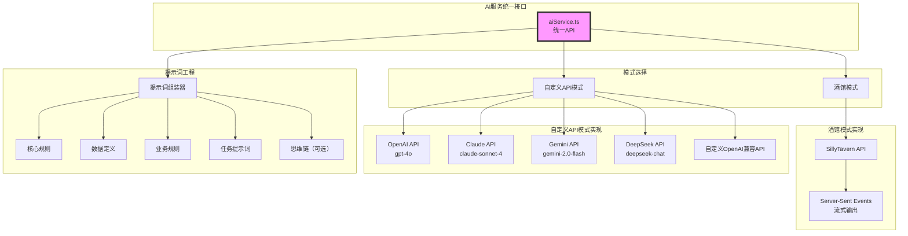
```mermaid
graph TB
    subgraph "AI服务统一接口"
        AIService["aiService.ts<br/>统一API"]
    end

    subgraph "模式选择"
        TavernMode["酒馆模式"]
        CustomMode["自定义API模式"]
    end

    subgraph "酒馆模式实现"
        TavernAPI["SillyTavern API"]
        TavernSSE["Server-Sent Events<br/>流式输出"]
    end

    subgraph "自定义API模式实现"
        OpenAI["OpenAI API<br/>gpt-4o"]
        Claude["Claude API<br/>claude-sonnet-4"]
        Gemini["Gemini API<br/>gemini-2.0-flash"]
        DeepSeek["DeepSeek API<br/>deepseek-chat"]
        Custom["自定义OpenAI兼容API"]
    end

    subgraph "提示词工程"
        CoreRules["核心规则"]
        DataDef["数据定义"]
        BusinessRules["业务规则"]
        TaskPrompts["任务提示词"]
        CoT["思维链（可选）"]
        Assembler["提示词组装器"]
    end

    AIService --> TavernMode
    AIService --> CustomMode

    TavernMode --> TavernAPI
    TavernAPI --> TavernSSE

    CustomMode --> OpenAI
    CustomMode --> Claude
    CustomMode --> Gemini
    CustomMode --> DeepSeek
    CustomMode --> Custom

    AIService --> Assembler
    Assembler --> CoreRules
    Assembler --> DataDef
    Assembler --> BusinessRules
    Assembler --> TaskPrompts
    Assembler --> CoT

    style AIService fill:#f9f,stroke:#333,stroke-width:4px
```

### 8.2 提示词工程架构

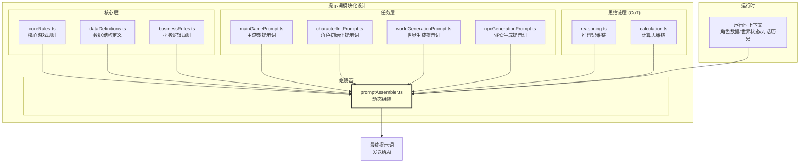
```mermaid
graph TB
    subgraph "提示词模块化设计"
        subgraph "核心层"
            CoreRules["coreRules.ts<br/>核心游戏规则"]
            DataDef["dataDefinitions.ts<br/>数据结构定义"]
            BusinessRules["businessRules.ts<br/>业务逻辑规则"]
        end

        subgraph "任务层"
            MainGame["mainGamePrompt.ts<br/>主游戏提示词"]
            CharInit["characterInitPrompt.ts<br/>角色初始化提示词"]
            WorldGen["worldGenerationPrompt.ts<br/>世界生成提示词"]
            NPCGen["npcGenerationPrompt.ts<br/>NPC生成提示词"]
        end

        subgraph "思维链层 (CoT)"
            ReasoningCoT["reasoning.ts<br/>推理思维链"]
            CalculationCoT["calculation.ts<br/>计算思维链"]
        end

        subgraph "组装器"
            Assembler["promptAssembler.ts<br/>动态组装"]
        end
    end

    subgraph "运行时"
        Context["运行时上下文<br/>角色数据/世界状态/对话历史"]
    end

    CoreRules --> Assembler
    DataDef --> Assembler
    BusinessRules --> Assembler
    MainGame --> Assembler
    CharInit --> Assembler
    WorldGen --> Assembler
    NPCGen --> Assembler
    ReasoningCoT --> Assembler
    CalculationCoT --> Assembler

    Context --> Assembler

    Assembler --> FinalPrompt["最终提示词<br/>发送给AI"]

    style Assembler fill:#ffd,stroke:#333,stroke-width:3px
```

**提示词组装示例**:
```typescript
// src/utils/prompts/promptAssembler.ts
function assembleMainGamePrompt(context: GameContext): string {
  return `
    ${coreRules}
    ${dataDefinitions}
    ${businessRules}

    ## 当前角色状态
    ${JSON.stringify(context.character)}

    ## 当前世界信息
    ${JSON.stringify(context.world)}

    ## 对话历史（最近10条）
    ${context.conversationHistory.slice(-10)}

    ## 任务要求
    ${mainGameTaskPrompt}

    ## 输出格式
    ${outputFormatRules}
  `;
}
```

### 8.3 AI响应处理流程

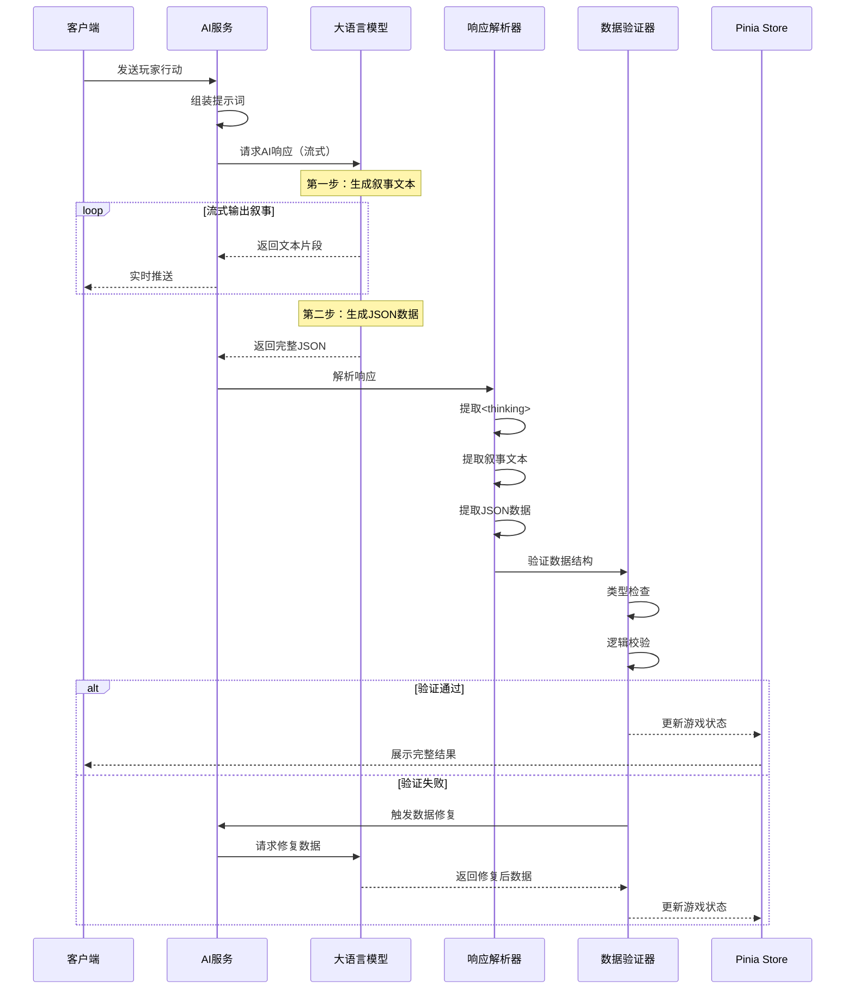
```mermaid
sequenceDiagram
    participant Client as 客户端
    participant AIService as AI服务
    participant LLM as 大语言模型
    participant Parser as 响应解析器
    participant Validator as 数据验证器
    participant Store as Pinia Store

    Client->>AIService: 发送玩家行动
    AIService->>AIService: 组装提示词
    AIService->>LLM: 请求AI响应（流式）

    Note over LLM: 第一步：生成叙事文本
    loop 流式输出叙事
        LLM-->>AIService: 返回文本片段
        AIService-->>Client: 实时推送
    end

    Note over LLM: 第二步：生成JSON数据
    LLM-->>AIService: 返回完整JSON

    AIService->>Parser: 解析响应
    Parser->>Parser: 提取<thinking>
    Parser->>Parser: 提取叙事文本
    Parser->>Parser: 提取JSON数据

    Parser->>Validator: 验证数据结构
    Validator->>Validator: 类型检查
    Validator->>Validator: 逻辑校验

    alt 验证通过
        Validator-->>Store: 更新游戏状态
        Store-->>Client: 展示完整结果
    else 验证失败
        Validator->>AIService: 触发数据修复
        AIService->>LLM: 请求修复数据
        LLM-->>Validator: 返回修复后数据
        Validator-->>Store: 更新游戏状态
    end
```

**核心文件**:
- `src/services/aiService.ts:1-1200` - AI服务主文件
- `src/utils/prompts/promptAssembler.ts:1-400` - 提示词组装
- `src/utils/dataValidation.ts:1-500` - 数据验证

---

## 9. 存储方案设计

### 9.1 存储架构

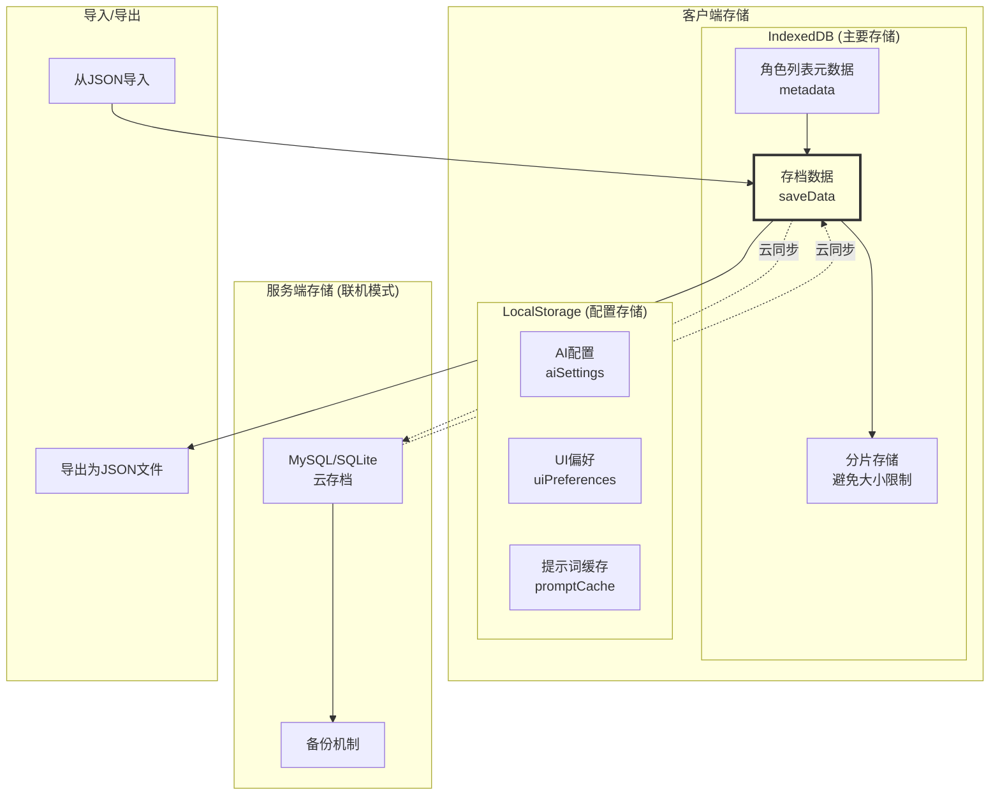
```mermaid
graph TB
    subgraph "客户端存储"
        subgraph "IndexedDB (主要存储)"
            IDB_Meta["角色列表元数据<br/>metadata"]
            IDB_Save["存档数据<br/>saveData"]
            IDB_Shard["分片存储<br/>避免大小限制"]
        end

        subgraph "LocalStorage (配置存储)"
            LS_AI["AI配置<br/>aiSettings"]
            LS_UI["UI偏好<br/>uiPreferences"]
            LS_Prompt["提示词缓存<br/>promptCache"]
        end
    end

    subgraph "服务端存储 (联机模式)"
        Server_DB["MySQL/SQLite<br/>云存档"]
        Server_Backup["备份机制"]
    end

    subgraph "导入/导出"
        Export["导出为JSON文件"]
        Import["从JSON导入"]
    end

    IDB_Meta --> IDB_Save
    IDB_Save --> IDB_Shard

    IDB_Save -.云同步.-> Server_DB
    Server_DB -.云同步.-> IDB_Save
    Server_DB --> Server_Backup

    IDB_Save --> Export
    Import --> IDB_Save

    style IDB_Save fill:#ffd,stroke:#333,stroke-width:3px
```

### 9.2 数据结构设计

#### 9.2.1 存档数据结构（SaveData）

```typescript
interface SaveData {
  // 基础信息
  baseInfo: CharacterBaseInfo;          // 角色基础信息（名字、性别、种族等）

  // 核心状态
  playerStatus: {
    realm: RealmInfo;                   // 当前境界
    attributes: SixDimensionalAttributes; // 六维属性
    health: { current: number; max: number };
    mana: { current: number; max: number };
    lifespan: { current: number; max: number };
    cultivation: { current: number; required: number };
  };

  // 物品系统
  inventory: {
    items: Item[];                      // 背包物品
    equipped: {                         // 已装备
      weapon?: Item;
      armor?: Item;
      accessory?: Item[];
    };
    capacity: number;                   // 背包容量
  };

  // 技能系统
  skills: {
    techniques: Technique[];            // 已掌握功法
    proficiency: Record<string, number>; // 熟练度
  };

  // 三千大道
  thousandDao: {
    unlocked: DaoPath[];                // 已解锁的大道
    progress: Record<string, number>;   // 领悟进度
  };

  // 人际关系
  relationships: {
    npcs: Record<string, NPCRelation>;  // NPC关系
    factions: Record<string, FactionRelation>; // 势力关系
  };

  // 世界信息
  worldInfo: {
    currentLocation: Location;          // 当前位置
    unlockedAreas: string[];            // 已解锁区域
    globalEvents: Event[];              // 全局事件
  };

  // 任务系统
  quests: {
    active: Quest[];                    // 进行中任务
    completed: Quest[];                 // 已完成任务
    failed: Quest[];                    // 失败任务
  };

  // 记忆系统
  memory: {
    shortTerm: Memory[];                // 短期记忆（最近10条）
    midTerm: Memory[];                  // 中期记忆（AI总结）
    longTerm: Memory[];                 // 长期记忆（关键信息）
  };

  // 游戏时间
  gameTime: {
    year: number;
    month: number;
    day: number;
    totalDays: number;
  };

  // 系统配置
  systemSettings: {
    difficulty: 'easy' | 'normal' | 'hard';
    enableNSFW: boolean;
    enableSystemQuests: boolean;
  };
}
```

**文件**: `src/types/game.d.ts:1-2000`

### 9.3 IndexedDB管理

```mermaid
sequenceDiagram
    participant App as 应用
    participant Manager as indexedDBManager
    participant IDB as IndexedDB
    participant LS as LocalStorage

    App->>Manager: initializeDB()
    Manager->>IDB: 打开数据库
    IDB-->>Manager: 数据库连接

    Manager->>IDB: 创建对象存储
    Note over IDB: 存储: metadata, saveData

    App->>Manager: loadCharacter(characterId)
    Manager->>IDB: 查询元数据
    IDB-->>Manager: 返回CharacterProfile

    Manager->>IDB: 查询存档数据
    IDB-->>Manager: 返回分片数据
    Manager->>Manager: 合并分片
    Manager-->>App: 返回完整SaveData

    App->>Manager: saveCharacter(saveData)
    Manager->>Manager: 检查数据大小
    alt 数据 > 5MB
        Manager->>Manager: 分片存储
        loop 每个分片
            Manager->>IDB: 存储分片
        end
    else 数据 <= 5MB
        Manager->>IDB: 直接存储
    end

    Manager->>LS: 同步元数据
    Manager-->>App: 保存成功
```

**核心文件**: `src/utils/indexedDBManager.ts:1-800`

**关键功能**:
- 自动分片（避免单个条目超过浏览器限制）
- 数据迁移（从localStorage迁移到IndexedDB）
- 错误恢复（损坏数据自动修复）
- 性能优化（批量操作、索引优化）

---

## 10. 部署与CI/CD

### 10.1 部署架构

```mermaid
graph TB
    subgraph "开发环境"
        Dev["本地开发<br/>webpack-dev-server"]
    end

    subgraph "CI/CD Pipeline"
        GitHub["GitHub Repository"]
        GHA["GitHub Actions"]

        subgraph "工作流"
            CI["ci.yml<br/>类型检查+构建"]
            Docker["docker.yml<br/>Docker镜像"]
            Release["release.yml<br/>发布版本"]
            Pages["pages.yml<br/>静态部署"]
        end
    end

    subgraph "容器化部署"
        DockerHub["Docker Hub<br/>镜像仓库"]
        DockerImage["qianye60/xiantu:latest"]
    end

    subgraph "生产环境"
        subgraph "前端服务"
            Nginx["Nginx<br/>静态文件服务"]
            SPA["Vue SPA<br/>dist/"]
        end

        subgraph "后端服务"
            FastAPI["FastAPI<br/>:12345"]
            DB["SQLite/MySQL"]
        end

        subgraph "静态托管"
            GHPages["GitHub Pages<br/>在线演示"]
        end
    end

    Dev --> GitHub
    GitHub --> GHA
    GHA --> CI
    GHA --> Docker
    GHA --> Release
    GHA --> Pages

    Docker --> DockerHub
    DockerHub --> DockerImage

    DockerImage --> Nginx
    DockerImage --> FastAPI

    Nginx --> SPA
    FastAPI --> DB

    Pages --> GHPages

    style DockerImage fill:#f9f,stroke:#333,stroke-width:3px
    style GHPages fill:#9f9,stroke:#333,stroke-width:2px
```

### 10.2 Docker多阶段构建

```dockerfile
# 阶段1: 构建前端
FROM node:18-alpine AS frontend-builder
WORKDIR /app
COPY package*.json ./
RUN npm ci --only=production
COPY . .
RUN npm run build

# 阶段2: 生产环境
FROM nginx:alpine
COPY nginx.conf /etc/nginx/conf.d/default.conf
COPY --from=frontend-builder /app/dist /usr/share/nginx/html
EXPOSE 80
CMD ["nginx", "-g", "daemon off;"]
```

**优势**:
- 减小镜像体积（仅包含构建产物）
- 安全性（不暴露源代码和依赖）
- 快速部署（镜像优化）

**文件**: `Dockerfile:1-20`

### 10.3 GitHub Actions工作流

#### 10.3.1 CI工作流

```yaml
name: CI
on: [push, pull_request]

jobs:
  build:
    runs-on: ubuntu-latest
    steps:
      - uses: actions/checkout@v3

      - name: Setup Node.js
        uses: actions/setup-node@v3
        with:
          node-version: '18'

      - name: Install dependencies
        run: npm ci

      - name: Type check
        run: npm run type-check

      - name: Build
        run: npm run build
```

**文件**: `.github/workflows/ci.yml:1-40`

#### 10.3.2 Docker工作流

```yaml
name: Docker Build and Push
on:
  push:
    tags:
      - 'v*'

jobs:
  docker:
    runs-on: ubuntu-latest
    steps:
      - uses: actions/checkout@v3

      - name: Login to Docker Hub
        uses: docker/login-action@v2
        with:
          username: ${{ secrets.DOCKER_USERNAME }}
          password: ${{ secrets.DOCKER_PASSWORD }}

      - name: Build and push
        uses: docker/build-push-action@v4
        with:
          context: .
          push: true
          tags: qianye60/xiantu:latest,qianye60/xiantu:${{ github.ref_name }}
```

**文件**: `.github/workflows/docker.yml:1-50`

### 10.4 Nginx配置

```nginx
server {
    listen 80;
    server_name _;
    root /usr/share/nginx/html;
    index index.html;

    # Gzip压缩
    gzip on;
    gzip_types text/plain text/css application/json application/javascript;

    # SPA路由支持
    location / {
        try_files $uri $uri/ /index.html;
    }

    # 静态资源缓存
    location ~* \.(js|css|png|jpg|jpeg|gif|ico|svg)$ {
        expires 1y;
        add_header Cache-Control "public, immutable";
    }

    # API代理（可选）
    location /api {
        proxy_pass http://backend:12345;
        proxy_set_header Host $host;
        proxy_set_header X-Real-IP $remote_addr;
    }
}
```

**文件**: `nginx.conf:1-40`

---

## 11. 安全与性能

### 11.1 安全机制

```mermaid
graph TB
    subgraph "前端安全"
        XSS["XSS防护<br/>Vue自动转义+文本消毒"]
        CSRF["CSRF防护<br/>JWT Token认证"]
        InputValidation["输入验证<br/>客户端+服务端双重验证"]
        SecureStorage["安全存储<br/>敏感数据加密"]
    end

    subgraph "后端安全"
        SQLInjection["SQL注入防护<br/>ORM参数化查询"]
        PasswordHash["密码安全<br/>Bcrypt哈希（成本12）"]
        JWT["JWT认证<br/>有效期+刷新机制"]
        RBAC["权限控制<br/>基于角色的访问控制"]
        CORS["CORS配置<br/>严格的跨域策略"]
    end

    subgraph "数据安全"
        Encryption["API Key加密"]
        Privacy["隐私保护<br/>不暴露敏感信息"]
        Backup["数据备份<br/>防止数据丢失"]
    end

    style XSS fill:#f99,stroke:#333
    style SQLInjection fill:#f99,stroke:#333
    style JWT fill:#9f9,stroke:#333
```

**安全文件**:
- `src/utils/textSanitizer.ts:1-100` - XSS防护
- `server/core/security.py:1-200` - JWT认证与密码哈希
- `src/utils/dataValidation.ts:1-500` - 数据验证

### 11.2 性能优化策略

#### 11.2.1 前端性能优化

```mermaid
graph TB
    subgraph "代码优化"
        CodeSplit["代码分割<br/>路由懒加载"]
        TreeShake["Tree Shaking<br/>移除未使用代码"]
        Minify["代码压缩<br/>Webpack压缩"]
    end

    subgraph "渲染优化"
        VirtualList["虚拟列表<br/>大数据渲染"]
        KeepAlive["组件缓存<br/><keep-alive>"]
        Debounce["防抖节流<br/>减少计算"]
    end

    subgraph "资源优化"
        CDN["CDN加载<br/>Vue/jQuery等"]
        LazyLoad["懒加载<br/>视频/图片"]
        Gzip["Gzip压缩<br/>传输优化"]
    end

    subgraph "存储优化"
        IDB["IndexedDB<br/>大容量存储"]
        Cache["浏览器缓存<br/>静态资源"]
        Shard["数据分片<br/>避免大小限制"]
    end

    CodeSplit --> TreeShake
    TreeShake --> Minify

    VirtualList --> KeepAlive
    KeepAlive --> Debounce

    CDN --> LazyLoad
    LazyLoad --> Gzip

    IDB --> Cache
    Cache --> Shard
```

**优化清单**:
- ✅ IndexedDB替代LocalStorage（突破5-10MB限制）
- ✅ 虚拟列表（背包/NPC列表）
- ✅ 防抖节流（搜索/滚动）
- ✅ CDN加载外部依赖
- ✅ 路由级别keep-alive
- ✅ 懒加载视频背景
- ⚠️ 图片懒加载（待优化）
- ⚠️ Service Worker（待实现）

#### 11.2.2 后端性能优化

```mermaid
graph TB
    subgraph "数据库优化"
        Index["索引优化<br/>常查字段建索引"]
        Query["查询优化<br/>避免N+1问题"]
        Cache["查询缓存<br/>静态数据缓存"]
    end

    subgraph "API优化"
        Async["异步处理<br/>FastAPI异步路由"]
        Pagination["分页查询<br/>大数据分页"]
        Compression["响应压缩<br/>Gzip"]
    end

    subgraph "连接优化"
        Pool["连接池<br/>数据库连接池"]
        KeepAlive["Keep-Alive<br/>HTTP持久连接"]
    end

    Index --> Query
    Query --> Cache

    Async --> Pagination
    Pagination --> Compression

    Pool --> KeepAlive
```

### 11.3 性能监控（待完善）

**建议集成**:
- **前端监控**: Sentry（错误追踪）、Google Analytics（用户行为）
- **性能监控**: Web Vitals（LCP、FID、CLS）
- **API监控**: 响应时间、错误率统计
- **资源监控**: 存储使用量、内存占用

---

## 12. 总结与展望

### 12.1 架构优势

#### 技术层面

1. **现代化技术栈**
   - Vue 3 + TypeScript + Pinia：紧跟前端最佳实践
   - FastAPI + Tortoise ORM：高性能异步后端
   - Docker + GitHub Actions：现代化DevOps

2. **架构清晰**
   - 分层设计（View-Store-Service-Utils）
   - 单一职责原则
   - 依赖注入与控制反转

3. **类型安全**
   - 全面的TypeScript类型定义（2000+行）
   - 编译时错误检测
   - 智能代码补全

4. **可维护性高**
   - 模块化设计
   - 代码规范（ESLint + Prettier）
   - CI/CD自动化

#### 业务层面

1. **AI深度集成**
   - 支持多种大模型（Gemini/Claude/OpenAI/DeepSeek）
   - 精细的提示词工程
   - 流式输出提升用户体验

2. **SillyTavern兼容**
   - 无缝嵌入式集成
   - 变量读写机制
   - 命令注入系统

3. **存储方案先进**
   - IndexedDB突破LocalStorage限制
   - 支持GB级存档
   - 云同步机制

4. **功能完整**
   - 完整修仙体系（境界/大道/功法）
   - 智能判定系统
   - 开放世界探索

### 12.2 改进空间

#### 短期优化

| 方向 | 具体措施 | 优先级 |
|------|---------|--------|
| **测试覆盖** | 引入Vitest/Jest单元测试<br/>Playwright E2E测试 | 高 |
| **性能监控** | 集成Sentry错误追踪<br/>Web Vitals性能监控 | 中 |
| **国际化** | 扩展i18n多语言支持 | 中 |
| **文档** | 完善API文档（OpenAPI）<br/>添加代码注释 | 中 |

#### 长期规划

1. **PWA支持**
   - Service Worker离线缓存
   - 桌面/移动端安装

2. **多人联机**
   - WebSocket实时通信
   - 协同游戏机制

3. **内容生成**
   - AI生成世界/NPC/任务
   - UGC创意工坊扩展

4. **性能优化**
   - 图片懒加载
   - 代码分割优化
   - 虚拟滚动扩展

### 12.3 技术亮点总结

```mermaid
mindmap
  root((仙途架构亮点))
    前端技术
      Vue 3 Composition API
      TypeScript严格类型
      Pinia状态管理
      IndexedDB大容量存储
    后端技术
      FastAPI异步高性能
      Tortoise ORM
      JWT认证
      Docker容器化
    AI集成
      多模型适配
      提示词工程
      流式输出
      数据验证与修复
    游戏系统
      完整修仙体系
      智能判定系统
      记忆系统
      开放世界
    特色功能
      SillyTavern深度集成
      多存档管理
      云同步
      创意工坊
    DevOps
      GitHub Actions CI/CD
      自动化部署
      代码规范检查
      多环境支持
```

### 12.4 总体评价

**仙途（XianTu）** 是一个架构设计优秀、技术栈先进、功能完整且持续迭代的**中大型开源项目**。

**核心价值**:
- ✅ 展现了对前端工程化的深刻理解
- ✅ AI集成的优秀实践案例
- ✅ 游戏系统设计的完整性
- ✅ 良好的可维护性和扩展性
- ✅ 活跃的社区和持续更新

**适合场景**:
- 前端工程化学习
- AI应用开发参考
- 文字冒险游戏开发
- SillyTavern扩展开发

**推荐指数**: ⭐⭐⭐⭐⭐ (5/5)

---

## 附录

### A. 核心文件清单

| 类别 | 文件路径 | 职责 | 代码行数 |
|------|---------|------|---------|
| **入口** | `src/main.ts` | Vue应用入口 | ~100 |
| **入口** | `src/App.vue` | 根组件 | ~200 |
| **入口** | `index.html` | HTML入口 | ~50 |
| **路由** | `src/router/index.ts` | 路由配置 | ~150 |
| **状态** | `src/stores/characterStore.ts` | 角色数据管理 | ~800 |
| **状态** | `src/stores/gameStateStore.ts` | 游戏状态管理 | ~600 |
| **服务** | `src/services/aiService.ts` | AI服务 | ~1200 |
| **服务** | `src/services/characterInitialization.ts` | 角色初始化 | ~400 |
| **工具** | `src/utils/indexedDBManager.ts` | 存储管理 | ~800 |
| **工具** | `src/utils/tavern.ts` | 酒馆集成 | ~300 |
| **工具** | `src/utils/prompts/promptAssembler.ts` | 提示词组装 | ~400 |
| **工具** | `src/utils/dataValidation.ts` | 数据验证 | ~500 |
| **类型** | `src/types/game.d.ts` | 游戏类型定义 | ~2000 |
| **数据** | `src/data/creationData.ts` | 创角数据 | ~1000 |
| **数据** | `src/data/realms.ts` | 境界定义 | ~150 |
| **后端** | `server/main.py` | 后端入口 | ~200 |
| **后端** | `server/models.py` | 数据模型 | ~500 |

### B. 技术栈版本清单

**前端依赖**:
```json
{
  "vue": "^3.5.18",
  "typescript": "~5.8.0",
  "pinia": "^3.0.4",
  "vue-router": "^4.6.4",
  "axios": "^1.11.0",
  "chart.js": "^4.5.1",
  "pixi.js": "^7.4.3",
  "idb": "^8.0.3",
  "webpack": "^5.99.8"
}
```

**后端依赖**:
```txt
fastapi>=0.104.0
uvicorn[standard]>=0.24.0
tortoise-orm>=0.20.0
aerich>=0.7.2
python-jose[cryptography]
passlib[bcrypt]
pydantic>=2.0.0
```

### C. 项目统计

| 指标 | 数值 |
|------|------|
| 总代码行数 | ~27,134行（前端） |
| 源文件数量 | 220+个 |
| Vue组件数量 | 70+个 |
| 工具函数模块 | 40+个 |
| TypeScript类型文件 | 9个 |
| API端点模块 | 18个 |
| 预设世界 | 10个 |
| 境界等级 | 9个 |
| 物品品质 | 7个 |
| 天资等级 | 7个 |
| 出身选项 | 15+种 |
| 项目大小 | 93MB |
| 当前版本 | V3.7.4 |
| 发布日期 | 2026-01-02 |

---

**文档版本**: 1.0
**生成日期**: 2026-01-05
**作者**: Claude Code
**项目地址**: https://github.com/qianye60/XianTu
